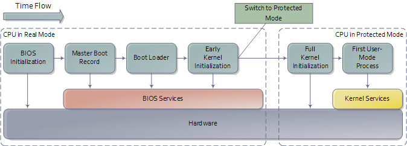
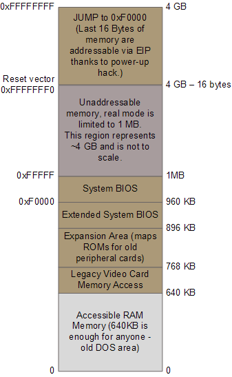

# How Computers Boot Up

- The post described [motherboards and the memory map](motherboard-chipsets-memory-map.md) in Intel computers to set the scene for the initial phases of boot.
- Booting is an involved, hacky, multi-stage affair - fun stuff. 

Here's na outline of the process:

- Things start rolling when you press the power button on the computer. Once the motherboard is powered up it initializes its own firmware - the chipset and other tidbits - and tries to get the CPU running.
- If things fail at this point (e.g., the CPU is busted or missing) then you will likely have a system that looks completely dead except for rotating fans.

- If all is well the CPU starts running.
- In a multi-processor or multi-core system one CPU is dynamically chosen to be the bootstrap processor (BSP) that runs all of the BIOS and kernel initialization code.
- The remaining processors, called application processors (AP) at this point, remain halted until later on when they are explicitly activated by the kernel.
- Intel CPUs have been evolving over the years but they're fully backwards compatible, so modern CPUs can behave like the original 1978 Intel 8086, which is exactly what they do after power up.
- In this primitive power up state the processor is in [real mode](https://en.wikipedia.org/wiki/Real_mode) with memory with memory paging disabled. This is like ancient MS-DOS where only 1 MB of memory can be addressed and any code can write to any place in memory - there's no notion of protection or privilege.

- Most registers in the CPU have well-defined values after power up, including the instruction pointer (EIP) which holds the memory address for the instruction being executed by the CPU.
- Intel CPUs use a hack whereby even though only 1MB of memory can be addressed at power up, a hidden base address (an offset, essentially) is applied to EIP so that the first instruction executed is at address 0xFFFFFFF0 (16 bytes short of the end of 4 gigs of memory and well above one megabyte).
- This magical address is called the [reset vector](https://en.wikipedia.org/wiki/Reset_vector) and is standard for modern Intel CPUs.

- The motherboard ensures that the instruction at the reset vector is a *jump* to the memory location mapped to the BIOS entry point. This jump implicitly clears the hidden base address present at power up.
- All of these memory locations have the right contents needed by the CPU thanks to the memory map kept by the chipset.They are all mapped to flash memory containing the BIOS since at this point the RAM modules have random crap in them.

An example of the relevant memory regions is shown below:

- The CPU then starts executing BIOS code, which initializes some of the hardware in the machine.
- Afterwards the BIOS kicks off the Power-on Self Test (POST) which tests various components in the computer.
- Lack of a working video card fails the POST and causes the BIOS to halt and emit beeps to let you know what's wrong, since messages on the screen aren't an option.
- A working video card takes us to a stage where the computer looks alive: manufacturer logos are printed, memory starts to be tested, angels blare their horns.
- Other POST failures, like a missing keyboard, lead to halts with an error message on the screen.
- The POST involves a mixture of testing and initialization, including sorting out all the resources - interrupts, memory ranges, I/O ports - for PCI devices.
- Modern BIOSes that follow the Advanced Configuration and Power Interface (ACPI) build a number of data tables that describe the devices in the computer, these tables are later used by the kernel.

- After the POST and BIOS wants to boot up an operating system, which must be found somewhere: hard drives, CD-ROM drives, floppy disks, etc.
- The actual order in which the BIOS seeks a boot device is user configurable.
- If there is no suitable boot device the BIOS halts with a complaint like "Non-System Disk or Disk Error".
- A dead hard drive might present with this symptom. Hopefully this doesn't happen and the BIOS finds a working disk allowing the boot to proceed.

- The BIOS now reads the first 512-byte sector (sector zero) of the hard disk.
- This is called the [Master Boot Record](https://en.wikipedia.org/wiki/Master_boot_record) and it normally contains two vital components: a tiny OS-specific bootstrapping program at the start of the MBR followed by a partition table for the disk.
- The BIOS however does not care about any of this: it simply loads the contents of the MBR into memory location 0x7c00 and jumps to that location to start executing whatever code is in the MBR.

- The specific code in the MBR could be a Windows MBR loader, code from loaders such as LILO or GRUB, or even a virus.
- In contrast the partition table is standardized: it is a 64-byte area with four 16-byte entries describing how the disk has been divided up (so you can run multiple operating systems or have separate volumes in the same disk).
- Traditionally Microsoft MBR code takes a look at the partition table, fins the (only) partition marked as active, loads the boot sector for that partition, and runs that code.
- The **boot sector** is the first sector of a partition, as opposed to the first sector for the whole disk. If something is wrong with the partition table you would get messages like "Invalid Partition Table" or "Missing Operating System".
- This message does **not** come from the BIOS but rather from the MBR code loaded from disk. Thus the specific message depends ont the MBR flavor.

- Boot loading has gotten more sophisticated and flexible over time. The Linux boot loaders LILO and GRUB can handle a wide variety of operating systems, file systems, and boot configurations.
- Their MBR code does not necessarily follow the "boot the active partition" approach described above. But functionally the process goes like this:

1. The MBR itself contains the first stage of the boot loader. GRUB calls this stage 1.
2. Due to its tiny size, the code in the MBR does just enough to load another sector from disk that contains additional bootstrap code. This sector might be the boot sector for a partition, but could also be a sector that was hard-coded into the MBR code when the MBR was installed.
3. The MBR code plus code loaded in step 2 then read a file containing the second stage of the boot loader. In GRUB this is GRUB Stage 2, and in Windows Server this is c:\NTLDR. The stage 2 code then reads a boot configuration file (e.g., grub.conf in GRUB, boot.ini in Windows). It then presents boot choices to the user or simply goes ahead in a single-boot system.
4. At this point the boot loader code needs to fire up a kernel. It must know enough about file systems to read the kernel from the boot partition. In Linux this means reading a file like "vmlinuz-2.6.22-14-server" containing the kernel, loading the file into memory and jumping to the kernel bootstrap code.

- The image for a current Linux kernel, even compressed, does not fit into the 640K of RAM available in real mode.
- Yet the boot loader must run in real mode in order to call the BIOS routines for reading from the disk, since the kernel is clearly not available at that point.
- The solution is the venerable [unreal mode](https://en.wikipedia.org/wiki/Unreal_mode).
- This is not a true processor mode, but rather a technique where a program switches back and forth between real mode and protected mode in order to access memory above 1MB while still using the BIOS.
- If you read GRUB source code, you'll see these transitions all over the place (look under stage2/ for calls to real_to_prot and prot_to_real).
- At the end of this sticky process the loader has stuffed the kernel in memory, by hook or by crook, but it leaves the processor in real mode when it's done.

We’re now at the jump from “Boot Loader” to “Early Kernel Initialization” as shown in the first diagram. That’s when things heat up as the kernel starts to unfold and set things in motion.

### Reference

* [How Computers Boot Up](http://duartes.org/gustavo/blog/post/how-computers-boot-up/) 
