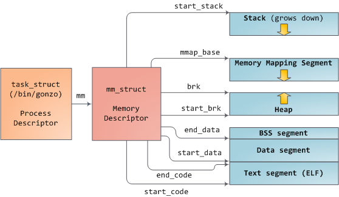
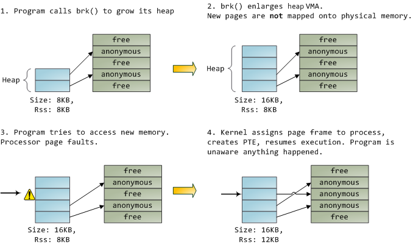

# How the Kernel Manages Your Memory

After examining the [virtual address layout](anatomy-of-a-program-in-memory.md) of a process, we turn to the kernel and its mechanisms for managing user memory. Here is gonzo again:

Linux processes are implemented in the kernel as instances of [task_struct](http://lxr.linux.no/linux+v2.6.28.1/include/linux/sched.h#L1075), the process descriptor. The [mm](http://lxr.linux.no/linux+v2.6.28.1/include/linux/sched.h#L1129) field in task_struct points to the **memory descriptor**, mm_struct, which is an executive summary of a program's memory. It stores the start and end of memory segments as shown above, the [number](http://lxr.linux.no/linux+v2.6.28.1/include/linux/mm_types.h#L197) of physical memory pages used by the process (**rss** stands for Resident Set Size), the [amount](http://lxr.linux.no/linux+v2.6.28.1/include/linux/mm_types.h#L206) of virtual address space used, and other tidbits. Within the memory descriptor we also find the two work horses for managing program memory: the set of **virtual memory areas** and the **page tables**.

Each virtual memory area (VMA) is a contiguous range of virtual addresses; these areas never overlap. An instance of [vm_area_struct](http://lxr.linux.no/linux+v2.6.28.1/include/linux/mm_types.h#L99) fully describes a memory area, including its start and end addresses, [flags](http://lxr.linux.no/linux+v2.6.28/include/linux/mm.h#L76) to determine access rights and behaviors, and [vm_file](http://lxr.linux.no/linux+v2.6.28.1/include/linux/mm_types.h#L150) field to specify which file is being mapped by the area, if any. A VMA that does not map a file is **anonymous**. Each memory segment above (e.g., heap, stack) corresponds to single VMA, with the execption of the memory mapping segment. This is not a requirement, though it is usual in x86 machines. VMAs do not care which segment they are in.

A program's VMAs are stored in its memory descriptor both as a linked list in the [mmap](http://lxr.linux.no/linux+v2.6.28.1/include/linux/mm_types.h#L174) field, ordered by starting virtual address, and as a red-black tree rooted at the [mm_rb](http://lxr.linux.no/linux+v2.6.28.1/include/linux/mm_types.h#L175) field. The red-black tree allows the kernel to search quickly for the memory area covering a given virtual address. When you read file `/proc/pid_of_processes/maps`, the kernel is simply going through the linked list of VMAs for the process and [printing each one](http://lxr.linux.no/linux+v2.6.28.1/fs/proc/task_mmu.c#L201).

The 4GB virtual address space is divided into **pages**. x86 processors in 32-bit mode support page sizes of 4KB, 2MB, and 4MB. Both Linux and Windows map the user portion of the virtual address space using 4KB pages. Bytes 0-4095 fall in page 0, bytes 4096-8191 fall in page 1, and so on. The size of a VMA must be a multiple of page size. Here’s 3GB of user space in 4KB pages:

The processor consults page tables to translate a virtual address into a physical memory address. Each process has its own set of page tables; whenever a process switch occurs, page tables for user space are switched as well. Linux stores a pointer to a process’ page tables in the [pgd](http://lxr.linux.no/linux+v2.6.28.1/include/linux/mm_types.h#L185) field of the memory descriptor. To each virtual page there corresponds one page table entry (PTE) in the page tables, which in regular x86 paging is a simple 4-byte record shown below:

Linux has functions to [read](http://lxr.linux.no/linux+v2.6.28.1/arch/x86/include/asm/pgtable.h#L173) and [set](http://lxr.linux.no/linux+v2.6.28.1/arch/x86/include/asm/pgtable.h#L230) each flag in a PTE. 

- Bit P tells the processor whether the virtual page is **present** in physical memory. If clear (equal to 0), accessing the page triggers a page fault. Keep in mind that when this bit is zero, **the kernel can do whatever it pleases** with the remaining fields.
- The R/W flag stands for read/write; if clear, the page is read-only.
- Flag U/S stands for user/supervisor; if clear, then the page can only be accessed by the kernel.
- These flags are used to implement the read-only memory and protected kernel space we saw before.
- Bits D and A for *dirty* and *accessed*. A dirty page has had a write, while an accessed page has had a writer or read. Both flags are sticky: the processor only sets them, they must be cleared by the kernel.

Finally, the PTE stores the starting physical address that corresponds to this page, aligned to 4KB. This naive-looking field is the source of some pain, for it limits addressable physical memory to 4 GB (2^20 * 2^12 bytes). The other PTE fields are for another day, as is Physical Address Extension.

A virtual page is the unit of memory protection because all of its bytes share the U/S and R/W flags. However, the same physical memory could be mapped by different pages, possibly with different protection flags. Notice that execute permissions are nowhere to be seen in the PTE. This is why classic x86 paging allows code on the stack to be executed, making it easier to exploit stack buffer overflows (it's still possible to exploit non-executable stacks using [return-to-libc](https://en.wikipedia.org/wiki/Return-to-libc_attack) and other techniques). This lack of a PTE no-execute flag illustrates a broader fact: permission flags in a VMA may or may not translate cleanly into hardware protection. The kernel does what it can, but ultimately the architecture limits what is possible.

Virtual memory doesn’t store anything, it simply maps a program’s address space onto the underlying physical memory, which is accessed by the processor as a large block called the **physical address space**. While memory operations on the bus are somewhat involved, we can ignore that here and assume that physical addresses range from zero to the top of available memory in one-byte increments. This physical address space is broken down by the kernel into **page frames**. The processor doesn't know or care about frames, yet they are crucial to the kernel because **the page frame is the unit of physical memory management**. Both Linux and Windows use 4KB page frames in 32-bit mode; here is an example of a machine with 2GB of RAM:

In Linux each page frame is tracked by a descriptor and several flags. Together these descriptors track the entire physical memory in the computer; the precise state of each page frame is always known. Physical memory is managed with the buddy memory allocation technique, hence a page frame is **free** if it’s available for allocation via the buddy system. An allocated page frame might be **anonymous**, holding program data, or it might be in the **page cache**, holding data stored in a file or block device.

Let's put together virtual memory areas, page table entries and page frames to understand how this all works. Below is an example of a user heap:

Blue rectangles represent pages in the VMA range, while arrows represent page table entries mapping pages onto page frames. Some virtual pages lack arrows; this means their corresponding PTEs have the **Present** flag clear. This could be because the pages have never been touched or because their contents have been swapped out. In either case access to these pages will lead to page faults, even though they are within the VMA. It may seem strange for the VMA and the page tables to disagree, yet this often happens.

A VMA is like a contract between your program and the kernel. You ask for something to be done (memory allocated, a file mapped, etc.), the kernel says “sure”, and it creates or updates the appropriate VMA. But it does not actually honor the request right away, it waits until a page fault happens to do real work. The kernel is a lazy, deceitful sack of scum; this is the fundamental principle of virtual memory. It applies in most situations, some familiar and some surprising, but the rule is that VMAs record what has been agreed upon, while PTEs reflect what has actually been done by the lazy kernel. These two data structures together manage a program’s memory; both play a role in resolving page faults, freeing memory, swapping memory out, and so on. Let’s take the simple case of memory allocation:

- When the program asks for more memory via the [brk()](http://man7.org/linux/man-pages/man2/brk.2.html) system call, the kernel simply [updates](http://lxr.linux.no/linux+v2.6.28.1/mm/mmap.c#L2050) the heap VMA and calls it good. No page frames are actually allocated at this point and the new pages are not present in physical memory.

- Once the program tries to access the pages, the processor page faults and [do_page_fault()](http://lxr.linux.no/linux+v2.6.28/arch/x86/mm/fault.c#L583) is called. It [searches](http://lxr.linux.no/linux+v2.6.28/arch/x86/mm/fault.c#L692) for the VMA covering the faulted virtual address using [find_vma()](http://lxr.linux.no/linux+v2.6.28/mm/mmap.c#L1466). If found, the permissions on the VMA are also checked against the attempted access (read or write). If there’s no suitable VMA, no contract covers the attempted memory access and the process is punished by Segmentation Fault.

- When a VMA is [found](http://lxr.linux.no/linux+v2.6.28/arch/x86/mm/fault.c#L711) the kernel must [handle](http://lxr.linux.no/linux+v2.6.28/mm/memory.c#L2653) the fault by looking at the PTE contents and the type of VMA. In our case, the PTE shows the page is [not present](http://lxr.linux.no/linux+v2.6.28/mm/memory.c#L2674). In fact, our PTE is completely blank (all zeros), which in Linux means the virtual page has never been mapped. Since this is an anonymous VMA, we have a purely RAM affair that must be handled by [do_anonymous_page()](http://lxr.linux.no/linux+v2.6.28/mm/memory.c#L2681), which allocates a page frame and makes a PTE to map the faulted virtual page onto the freshly allocated frame.

- Things could have been different. The PTE for a swapped out page, for example, has 0 in the Present flag but is not blank. Instead, it stores the swap location holding the page contents, which must be read from disk and loaded into a page frame by [do_swap_page()](http://lxr.linux.no/linux+v2.6.28/mm/memory.c#L2280) in what is called a [major fault](http://lxr.linux.no/linux+v2.6.28/mm/memory.c#L2316).

This concludes the first half of our tour through the kernel’s user memory management. 

In this post, it covers the important and often misunderstood relationship between files and memory and its consequences for performance: [Page Cache, the Affair Between Memory and Files](http://duartes.org/gustavo/blog/post/page-cache-the-affair-between-memory-and-files/)

### Reference

* [How the Kernel Manages Your Memory](http://duartes.org/gustavo/blog/post/how-the-kernel-manages-your-memory/)
